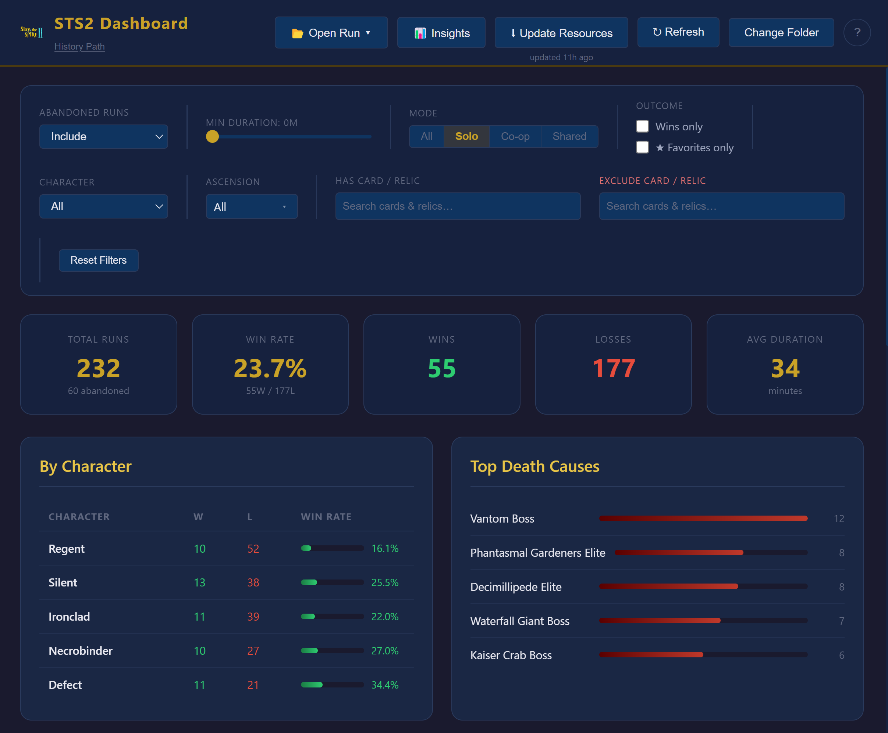
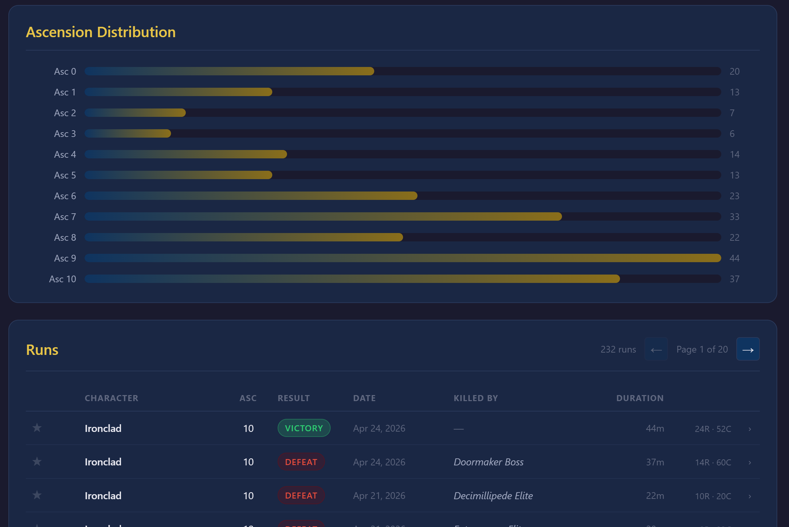
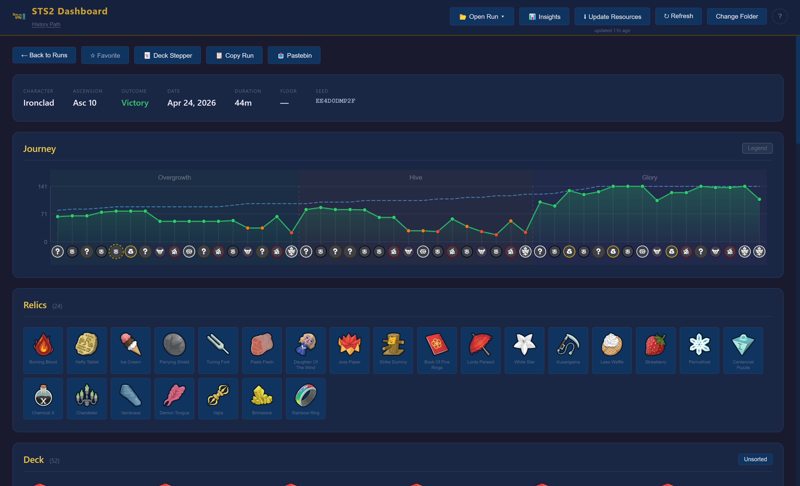
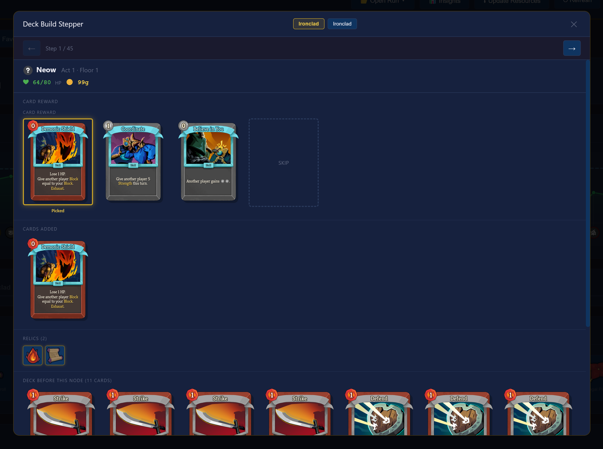
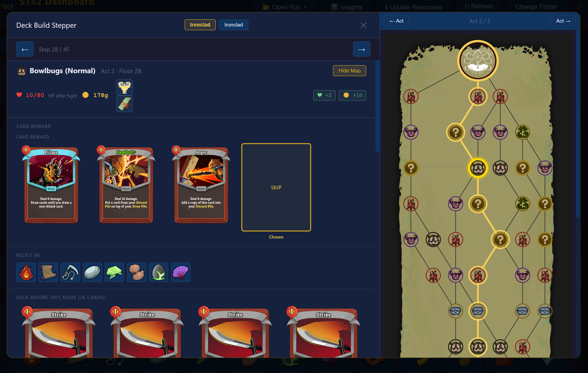
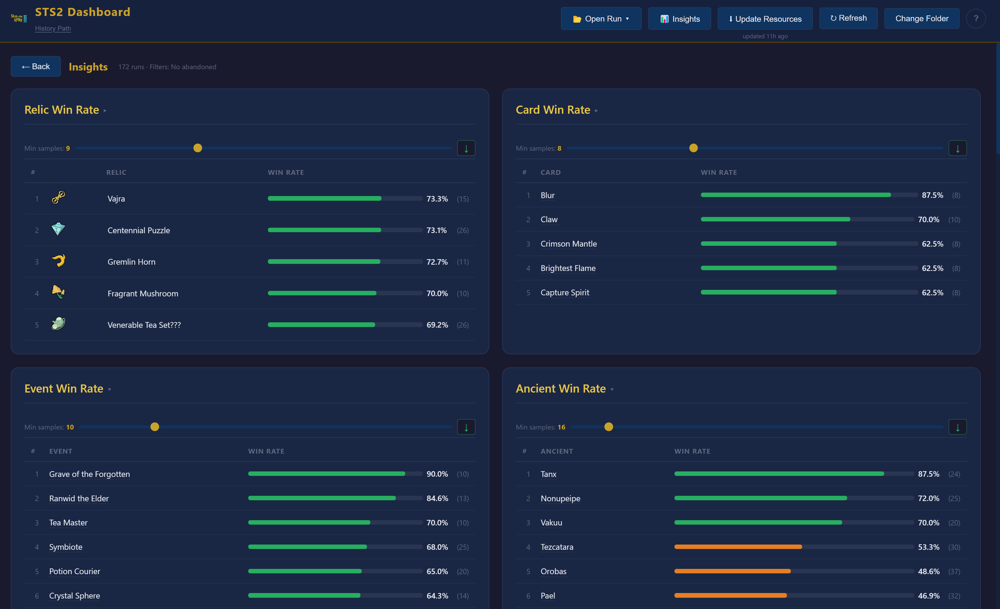
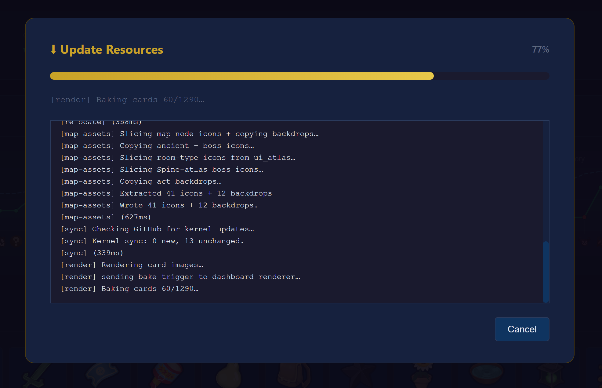

# STS2 Dashboard

A desktop statistics dashboard for **Slay the Spire 2** run history. Watches your `.run` folder, parses every run, and shows stats, run details, deck evolution + map render, and aggregate insights. Displays your deck and can step through you choices throughout the run with the patch accurate card + relic descrtiptions. Share runs with friends

---

## Quickstart

1. Launch `STS2 Dashboard 1.0.2.exe`.
2. On first run, browse to your STS2 history folder (where the game writes `.run` files) → **Continue to Dashboard**.
3. Click **Update Resources** in the header to download wiki data (relic/card images and descriptions). One-time step.

The folder is remembered; future launches go straight to the dashboard.

---

## Dashboard



The home view has three stacked sections:

- **Filters bar** — game mode (All / Solo / Co-op / **Shared**), character, ascension multi-select, win-only, abandoned handling, min duration, and tag-based **Has Card / Relic** + **Exclude Card / Relic** searches. All filters apply live to the stats and the run list.
- **Stats summary** — total runs, win rate, wins/losses, avg duration, character breakdown, top death causes, ascension distribution.
- **Run list** — every `.run` file as a row (character, ascension, outcome, date, duration). Click a row to open the detail view. Star a row to favorite it. The list auto-refreshes when files change in the folder.



The **Shared** mode tab lists runs you've imported via 📂 Open Run (from disk or Pastebin); they're stored separately from your own runs at `%APPDATA%\sts2-dashboard\Shared Runs\` and don't mix into your stats.

---

## Run Detail



Click any run to open its full detail page:

- **Meta header** — character(s), ascension, outcome, date, duration, floor, seed, gold, score. Co-op runs show a player tab bar that swaps the graph/relics/deck per player.
- **HP Journey graph** — current HP (green), max HP (blue dashed), color-coded HP dots, and act bands. **Click any node icon** under the graph for a popup with damage taken, healing, enemies fought, event chosen, relic picks, or rest action.
- **Relics** — every relic held at run end. Click for a popup with the wiki description.
- **Deck** — final deck as card images, with enchantment badges and upgraded artwork. Sort toggle switches between acquisition order and grouped (Powers → Attacks → Skills → Curses → Statuses).
- **Header buttons** — ★ Favorite, 📋 Copy `.run` to clipboard, 📤 Pastebin export, 🪜 Deck Stepper.

Almost everything is clickable for a detail popup: relics, cards (in the deck or in stepper rewards), enchantment badges, event names, potions, and HP-graph nodes all open a popup with the wiki description, image, and rarity/character info when available.

---

## Deck Stepper



A full-screen overlay that walks through the run node by node. Use the arrows or arrow keys to move between stops.

Each step shows: HP / Max HP / Gold with deltas, potions and relics held (newly acquired ones highlighted), card rewards offered (with the picked card highlighted, multiple rewards split into rows), shop inventory with purchases highlighted, and any cards added / removed / upgraded / transformed / enchanted. The current deck is rendered at the bottom. Co-op runs keep the player tabs in the header so you can switch players without losing your place.

### Map Side Panel



Click **Show Map** (top-right of the node header, or press **M**) to expand the modal with the act map for the current step. The map is reconstructed from the run's seed using the same algorithm as the game, then overlaid with the path you actually took (gold) and a halo on every visited node. The current step's node is highlighted in bright gold.

- **Click any node on your path** to jump the deck stepper directly to that step — handy for navigating long runs.
- **← Act / Act → buttons** at the top jump to the first node (Neow / ancient) of the previous or next act.

---

## Insights



Click **📊 Insights** in the header for aggregate stats across the currently filtered runs:

- Most-picked relics and cards (with seen-in counts)
- Win rate by character / ascension / relic / card
- Top death causes, deck size and act-clear distributions, and more

Each table is collapsible and sortable. Insight rows respect the same filters as the run list — narrow to a single character or ascension to see stats just for that slice.

---

## Update Resources



All game data — card art, relic icons, descriptions, events, potions, the map atlases — is extracted at runtime from your local **Slay the Spire 2** install. Nothing is bundled with the dashboard or scraped from a wiki, so the data always matches your installed patch byte-for-byte.

**On first launch the pipeline runs automatically** when no cached data is detected. After that, click **🔄 Update Resources** in the header any time a new STS2 patch ships and you want the dashboard to pick up the new content.

### What the pipeline does

1. **Detect** your STS2 Steam install (manual fallback if auto-detect fails).
2. **Install tools** (first run only) — [GDRE Tools](https://github.com/GDRETools/gdsdecomp) for unpacking Godot's PCK and [dnSpy](https://github.com/dnSpyEx/dnSpy) for decompiling `sts2.dll`. Cached under `%APPDATA%\sts2-dashboard\Tools\`; subsequent runs skip this step.
3. **Extract** the game's PCK — pulls images (cards, relics, events, ancients, monsters, potions, enchantments, map backdrops, `ui_atlas`), fonts, and English localization into a scratch dir.
4. **Decompile** `sts2.dll` into ~3,300 readable C# source files.
5. **Parse** the decompiled C# with JS-ported [spire-codex](https://github.com/ptrlrd/spire-codex) parsers to produce `cards.json`, `relics.json`, `events.json`, `potions.json`, `enchantments.json`.
6. **Simplify** into the dashboard's render-ready schema.
7. **Relocate** extracted images into `Assets/images/` so the renderer can reference them via the `appdata://` protocol.
8. **Map assets** — slice the `ui_atlas` for room-type icons (monster / elite / shop / rest / treasure / ?), copy the per-ancient and per-boss placeholder PNGs, compose the three Spine-atlas bosses (Ceremonial Beast / False Queen / The Insatiable) per `scripts/spine_specs/`, and copy each act's parchment backdrop strips.
9. **Sync kernels** from this repo — small JSON overrides used to reconstruct period-accurate stats for runs played on older patches.
10. **Render cards** — bakes every card (base + upgraded, plus Mad-Science variants) to a static PNG via the dashboard's canvas-2D renderer. This is the slow stage; expect ~1–2 minutes on first run.
11. **Cleanup** — drops the per-card portraits and the extraction scratch dir once the rendered PNGs are on disk.

Each stage logs progress live in a panel and can be cancelled at any time. The header label next to the button shows the date of the last successful update.

### Where things land

```
%APPDATA%\sts2-dashboard\
├── Assets\
│   ├── data\            ← cards.json, relics.json, events.json, potions.json, enchantments.json
│   ├── images\          ← cards/, relics/, events/, ancients/, monsters/, potions/, enchantments/,
│   │                      map_icons/ (room + ancient + boss icons), map_backdrops/<act>/
│   ├── shells/          ← pre-rendered card frames (Strategy B intermediate)
│   ├── data-extracted/  ← raw parser output (eng/)
│   ├── kernels-remote/  ← period-accurate stat overrides synced from this repo
│   └── settings\
└── Tools\
    ├── gdre\            ← GDRE Tools install
    └── dnspy\           ← dnSpy Console install
```

To force a fresh extraction from scratch, delete `Assets\data\` and `Assets\images\` and re-run the pipeline. To re-pull just the tools, also clear `Tools\`.

---

## Sharing & Importing Runs

- **📂 Open Run ▾** (header) → **From disk** opens any `.run` file; **From Pastebin** fetches a paste URL. Either way, the run is saved into the **Shared Runs** folder so it persists under the **Shared** mode tab.
- **📤 Pastebin** (run detail) uploads the current run and copies the URL to your clipboard. Requires a Pastebin API dev key — the app will prompt for it on first export.
- **📋 Copy** (run detail or run row) copies the `.run` file itself to the clipboard, ready to paste into a folder or chat.

---

## Data Storage

Everything lives under `%APPDATA%\sts2-dashboard\`:

```
sts2-dashboard\
├── Assets\
│   ├── data\        ← relics.json, cards.json, enchantments.json, events.json, potions.json
│   ├── images\      ← relic_images, card_images, enchantment_images, event_images, potion_images, map_icons
│   └── settings\    ← config.json, favorites.json, resource_meta.json
└── Shared Runs\     ← runs imported via Open Run
```

To reset the app to first-run state, delete `Assets\settings\config.json`. To re-pull all wiki data, clear `Assets\data\` and `Assets\images\` and run **Update Resources** again.

---

## Building from Source

Requires Node.js 18+.

```bash
npm install
npm run build
```

Output: `dist/STS2 Dashboard 1.0.2.exe` (portable executable).
